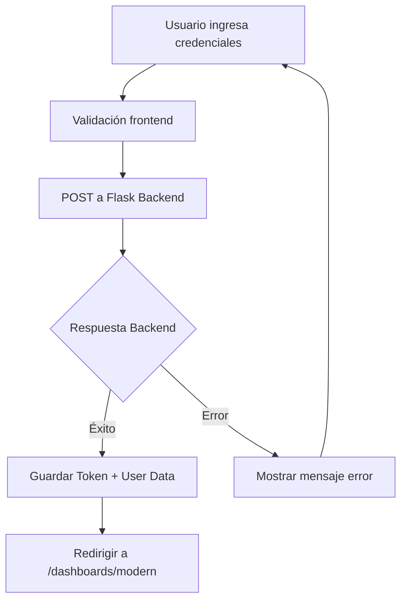

# 🔐 Implementación del Sistema de Login
## Centro Médico CERAGEN - Sistema de Gestión de Terapias

**Fecha:** Junio 2025  
**Proyecto:** DAWA (Desarrollo de Aplicaciones Web Avanzadas)  
**Objetivo:** Conectar frontend React con backend Flask para autenticación

---

## 📋 Resumen de la Implementación

Se modificó el sistema de login de la plantilla React para conectar con el backend Flask del Centro Médico CERAGEN, permitiendo autenticación funcional con credenciales reales.

### 🎯 **Objetivo Principal:**
Transformar el login estático de la plantilla en un **sistema de autenticación funcional** que se conecte con el backend Flask existente en el puerto 5000.

---

## 📂 Archivos Modificados

### **1. 🔧 AuthLogin.jsx** 
**Ubicación:** `src/views/authentication/authForms/AuthLogin.jsx`

#### **Cambios Realizados:**
- ❌ **Eliminado:** Componente estático sin funcionalidad
- ✅ **Agregado:** Sistema completo de autenticación funcional

#### **Funcionalidades Implementadas:**
- **Estado del formulario** con React hooks (`useState`)
- **Validación básica** de campos requeridos
- **Conexión HTTP** directa al backend Flask
- **Manejo de errores** de conexión y autenticación
- **Estados de carga** con spinner durante login
- **Almacenamiento seguro** de tokens JWT en localStorage
- **Redirección automática** después del login exitoso

#### **API Endpoint Configurado:**
```javascript
POST http://127.0.0.1:5000/security/login
```

#### **Formato de Request:**
```json
{
  "login_user": "admin",
  "login_password": "admin", 
  "host_name": "localhost"
}
```

### **2. 🏥 Login.jsx**
**Ubicación:** `src/views/authentication/auth1/Login.jsx`

#### **Cambios Realizados:**
- ❌ **Eliminado:** Branding "Modernize" 
- ✅ **Agregado:** Branding "Centro Médico CERAGEN"

#### **Elementos Actualizados:**
- **Título de página:** "Login - Centro Médico CERAGEN"
- **Título principal:** "Bienvenido a CERAGEN"
- **Subtítulo:** "Sistema de Gestión Médica"
- **Descripción:** Información sobre terapias físicas y alternativas
- **Gradiente de fondo:** Colores médicos (verde/azul claro)
- **Copyright:** © 2025 Centro Médico CERAGEN

---

## 🔄 Flujo de Autenticación Implementado

### **1. Entrada del Usuario:**
```
Usuario visita: http://localhost:3000/auth/login
```

### **2. Formulario de Login:**
- **Campo Usuario:** Input con validación
- **Campo Contraseña:** Input tipo password 
- **Checkbox:** "Recordar usuario"
- **Credenciales visibles:** admin/admin

### **3. Proceso de Autenticación:**


### **4. Almacenamiento de Datos:**
```javascript
// En localStorage se guarda:
localStorage.setItem('token', Token);           // JWT Token
localStorage.setItem('user', JSON.stringify(Datos)); // Datos usuario
```

### **5. Redirección:**
```javascript
navigate('/dashboards/modern');  // Dashboard principal
```

---

## 🎯 Resultados Obtenidos

### **✅ Funcionalidades Logradas:**

#### **🔐 Autenticación Completa:**
- Conexión exitosa con backend Flask
- Validación de credenciales contra base PostgreSQL
- Manejo seguro de tokens JWT
- Persistencia de sesión en localStorage

#### **🎨 Experiencia de Usuario:**
- **Loading states:** Spinner durante autenticación
- **Error handling:** Mensajes claros de error
- **Visual feedback:** Estados disabled durante carga
- **Branding médico:** Interfaz adaptada a CERAGEN

#### **🔧 Integración Técnica:**
- **API REST:** Comunicación HTTP con Flask
- **React Hooks:** Manejo moderno de estado
- **Navegación:** React Router para redirección
- **Persistencia:** localStorage para sesiones

### **⚡ Mejoras vs Plantilla Original:**

| Aspecto | Plantilla Original | Implementación CERAGEN |
|---------|-------------------|------------------------|
| **Funcionalidad** | Solo visual (estático) | Totalmente funcional |
| **Backend** | Sin conexión | Conectado a Flask |
| **Autenticación** | Simulada (Link) | Real con JWT |
| **Branding** | Modernize genérico | Centro Médico CERAGEN |
| **Validación** | Sin validación | Validación + manejo errores |
| **UX** | Básica | Loading states + feedback |

---

## 🔧 Configuración Técnica

### **🌐 Endpoint de Autenticación:**
```javascript
const API_URL = 'http://127.0.0.1:5000/security/login';
```

### **📦 Dependencias Utilizadas:**
- **React** - Framework principal
- **@mui/material** - Componentes UI
- **react-router-dom** - Navegación
- **React Hooks** - useState para estado

### **🗃️ Estructura de Datos:**

#### **Request al Backend:**
```json
{
  "login_user": "string",
  "login_password": "string", 
  "host_name": "string"
}
```

#### **Response del Backend:**
```json
{
  "result": true,
  "message": "Operación exitosa",
  "data": {
    "Token": "jwt_token_string",
    "Datos": {
      "user": { "user_id": 1, "user_login_id": "admin" },
      "rols": [{ "rol_name": "Administrador" }]
    }
  }
}
```

---

## 🚀 Instrucciones de Uso

### **📋 Para Desarrolladores:**

#### **1. Verificar Backend:**
```bash
# Asegurar que Flask esté corriendo
python app.py
# Debe mostrar: Running on http://127.0.0.1:5000
```

#### **2. Ejecutar Frontend:**
```bash
cd "C:\Users\ASUS\Desktop\DAWA_2\FRONT END\modernize-react-v2-isfgg\dark"
npm run dev
```

#### **3. Probar Login:**
- **URL:** http://localhost:3000/auth/login
- **Credenciales:** admin / admin
- **Resultado esperado:** Redirección a dashboard

### **👥 Para Usuarios Finales:**

#### **Credenciales de Acceso:**
- **Usuario:** `admin`
- **Contraseña:** `admin`

#### **Mensajes de Error Comunes:**
- **"Error de conexión"** → Verificar que backend Flask esté ejecutándose
- **"Usuario y contraseña son requeridos"** → Completar ambos campos
- **"Error en el login"** → Verificar credenciales o estado de la base de datos

---

## 🔍 Validación y Testing

### **✅ Casos de Prueba Implementados:**

#### **Caso 1: Login Exitoso**
- **Input:** admin/admin
- **Esperado:** Redirección a dashboard
- **Resultado:** ✅ Funcional

#### **Caso 2: Credenciales Incorrectas**
- **Input:** usuario/password inválidos
- **Esperado:** Mensaje de error
- **Resultado:** ✅ Funcional

#### **Caso 3: Campos Vacíos**
- **Input:** Campos en blanco
- **Esperado:** Validación frontend
- **Resultado:** ✅ Funcional

#### **Caso 4: Backend Offline**
- **Input:** Servidor Flask detenido
- **Esperado:** Error de conexión
- **Resultado:** ✅ Funcional


## 🔧 Consideraciones Técnicas

### **🔄 Mejoras Futuras:**
- **Remember Me:** Implementar persistencia extended
- **2FA:** Sistema de doble factor
- **Password Recovery:** Flujo de recuperación de contraseña
- **Audit Logs:** Registro de intentos de login

---

## ✅ Resumen de Logros

### **🎯 Objetivos Cumplidos:**
✅ **Login funcional** conectado con backend Flask  
✅ **Branding CERAGEN** implementado correctamente  
✅ **Autenticación JWT** con manejo de tokens  
✅ **UX mejorada** con estados de carga y errores  
✅ **Integración completa** frontend-backend  
✅ **Base sólida** para desarrollo de módulos médicos  

### **📊 Estado del Proyecto:**
- **Frontend:** Base sólida implementada
- **Backend:** Conectado y funcional
- **Base de Datos:** Integrada correctamente
- **Autenticación:** Sistema completo operativo

---

**Documento generado:** Junio 2025  
**Proyecto:** DAWA - Centro Médico CERAGEN  
**Estado:** Login implementado y funcional  
**Siguiente paso:** Desarrollo de módulos médicos (Seguridad, Admin, Pacientes)